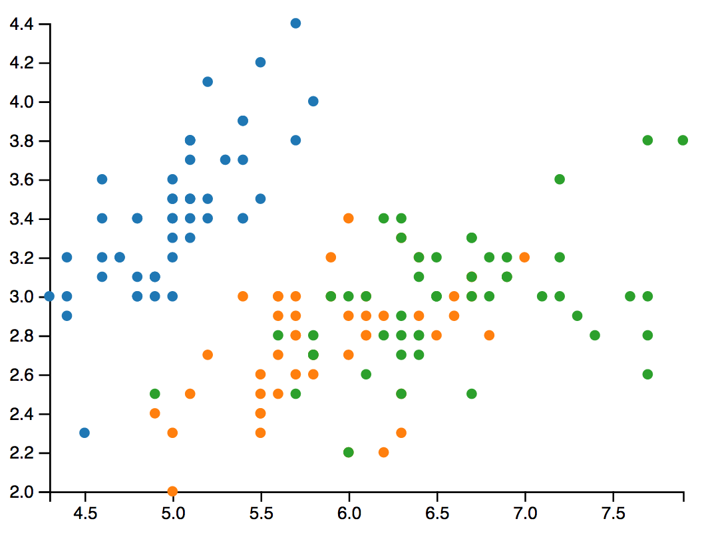

# Update the data inside a visualization

* change the viz by changing the visible dimensions inside the dataset
* change the datasets inside a visualization

Which parts of the visualization needs to be updated with other dimensions or a new dataset?


* x, y and the styling of the primitive is obvious
* x and y axis labeling based on the scaling
* the invisible x and y scaling

To redraw the part of the visualization that needs to be updated, will be inside a redraw function

## Restructure the source code

Before loading the dataset, some variables are needed:

* scaling with range, but no domain
* axis with styling
* svg group for drawing axis
* data and dimension variables

Inside the loading function

* filter / transform the dataset
* save data to variable
* call redraw function

## Redraw function

* update the domain of the scales
* update the drawing of the axis

* select all elements to redraw and set the data property. Internally it will recognize how many elements were previously in the selection and how many are now inside.

```
var dots = svg.selectAll('.dot')
    .data(data);
```

* remove elements that are leftover from the selection

```
dots.exit().remove();
```

* append further elements to the selection and set attributes that are the same for all elements
* merge new and old elements
* set attributes that has been changed

```
dots.enter().append('circle')
    .attr('class', 'dot')
    .attr('r', 3)
    .merge(dots)
    .attr('cy', function (d) {
        return y(d[yDimension]);
    })
    .attr('cx', function (d) {
        return x(d[xDimension]);
    })
    .style('fill', function (d) {
        return color(d.Species)
    })
```

## Transitions

* updates and changes inside visualizations needs to be visible for user
* otherwise user will loose the meaning of the visualization and loose their mental model
* transitions will calculate and draw a smooth movement between the old and the new position
* the mental model of the user will be maintained
* transition will be placed before the attributes or styles to change

```
...
    .merge(dots)
    .transition()
    .duration(500)
...
```

# References

* [What Makes Software Good?](https://medium.com/@mbostock/what-makes-software-good-943557f8a488)
* [Transition Documentation ](https://github.com/d3/d3-transition)
* [Join Data](https://github.com/d3/d3-selection#joining-data)


